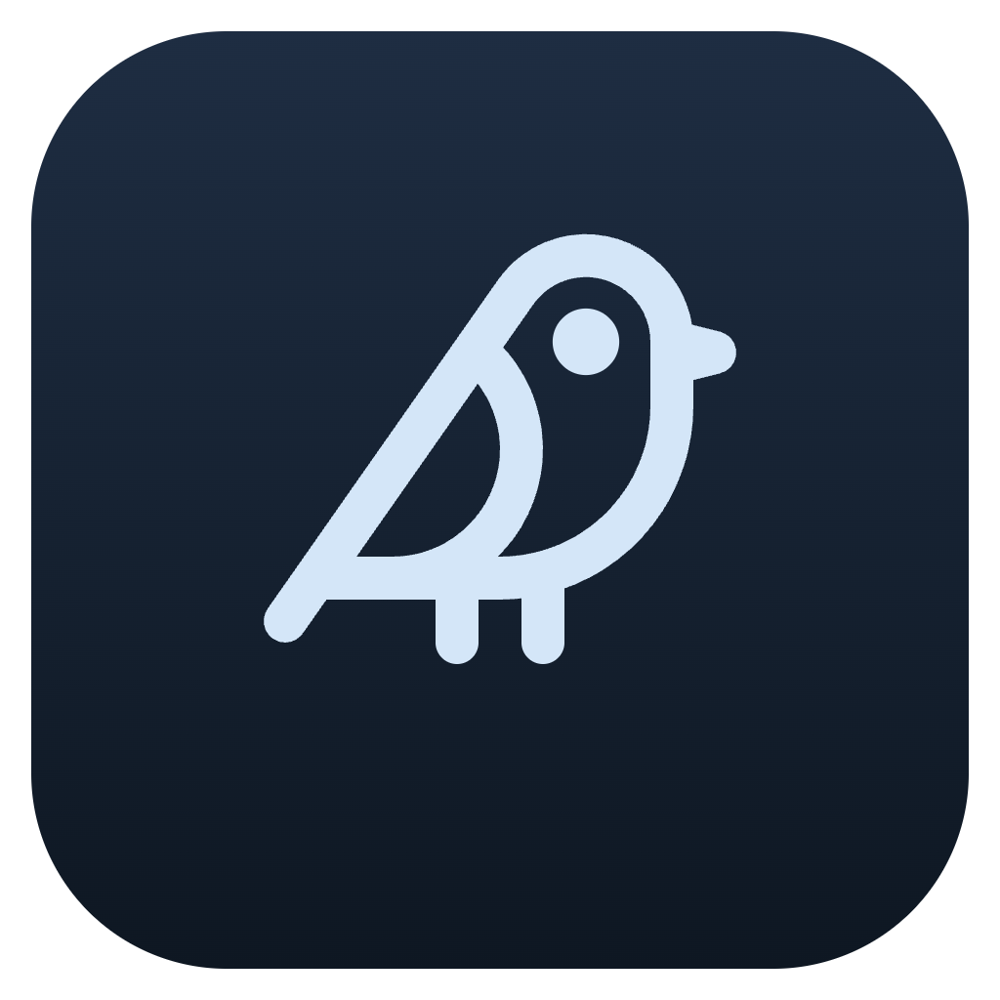
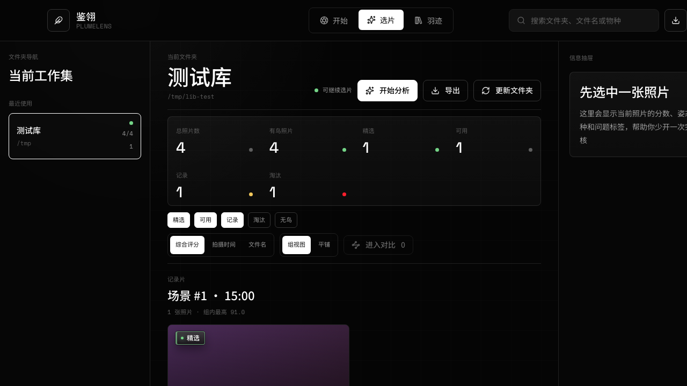
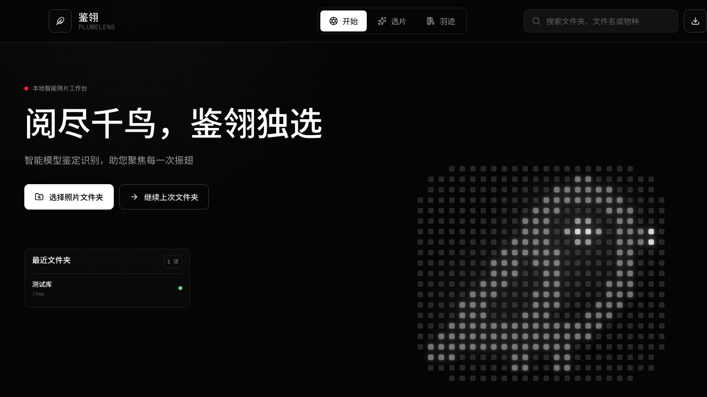
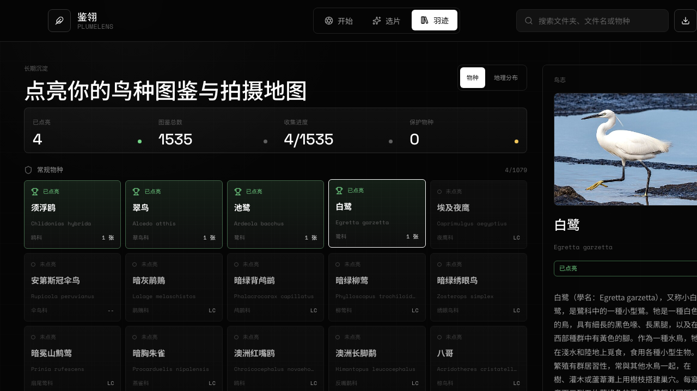
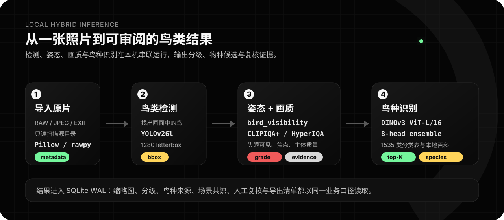
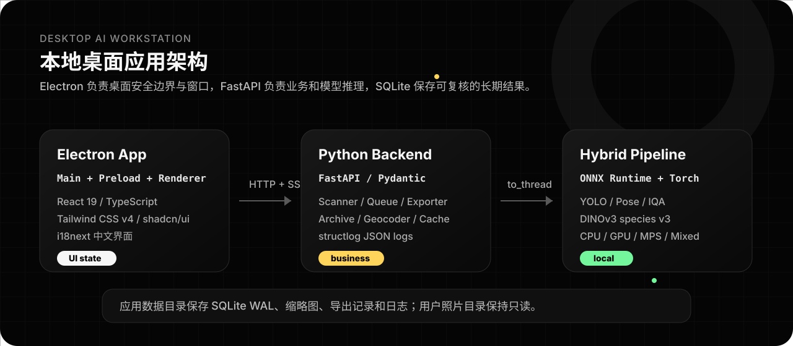

<p align="center">
  
</p>

<h1 align="center">PlumeLens / 鉴翎</h1>

<p align="center">
  面向鸟类摄影爱好者的本地智能选片工作台：检测鸟、识别鸟、评估画质、辅助复核，并把每一次外拍沉淀成自己的鸟种图鉴。
</p>

<p align="center">
  <a href="https://github.com/wlfcss/PlumeLens/actions/workflows/mac-build.yml"></a>
  
  
  
  <a href="LICENSE"></a>
</p>



## 为什么做它

一次鸟类外拍常常带回几百到几千张照片。真正耗时的不是拍摄，而是回家后反复判断：

| 痛点                     | PlumeLens 的处理方式                                 |
| ------------------------ | ---------------------------------------------------- |
| 照片太多，翻看成本高     | 自动检测鸟类主体，按综合质量先分档                   |
| 同一场景连拍重复         | 按场景/时间组织照片，优先展示更值得复核的图          |
| 远鸟、遮挡、焦点判断费眼 | 给出检测框、姿态点、IQA 裁切与对焦证据               |
| 鸟种识别容易受角度影响   | DINOv3 species v4 给出三态候选，组内共识修正常见偏差 |
| 选完以后还要整理输出     | 支持按文件夹别名导出、JPG/RAW 同伴文件、中文报告     |
| 拍过哪些鸟很难长期沉淀   | 羽迹模块按物种、保护等级和地理位置形成长期图鉴       |
| 源文件夹改名或挪走       | 保留缓存与筛选结果，提示重新关联新的源路径           |

核心原则很朴素：**照片分析在本地完成，用户照片目录只读，人工判断永远优先于模型判断。**

## 界面预览

| 开始                                            | 选片                                                    | 羽迹                                                |
| ----------------------------------------------- | ------------------------------------------------------- | --------------------------------------------------- |
|  |  |  |

## 0.7.6 导出修复与增强

0.7.6 起因是真实使用中的导出失败：964 张 / 80 GB 的导出在界面上反复报「导出失败」，后台其实一直在复制。

- **导出不再假失败**：导出改为后台任务，`POST` 立即返回 `job_id`，进度走 SSE，面板显示已处理张数、已复制体积和当前文件名，可随时取消。此前导出塞在单个 HTTP 请求里，前端 60 秒超时后报失败，后端却毫不知情地继续跑到底，用户重试还会叠加并发导出。
- **取消不留半截文件**：取消检查点落在照片之间，已完成的文件保留，不会产生大小不对的 RAW。应用关停也不再被复制线程堵死。
- **可选照片格式**：导出面板按源文件夹里实际存在的格式展示多选，并标出各自张数与体积。此前 RAW 同伴是硬编码强制包含的，只想导 25 GB 的 JPG 会被搭上 56 GB 的 CR3，直接撞上磁盘空间上限。
- **报错说人话**：后端返回结构化错误码，前端 i18next 渲染中文，空间不足会说明「约需 X，可用 Y，还差 Z」；同时修掉了错误提示被 CSS 裁成半句的问题。
- **移除文件夹**：文件夹右键可从工作集移除，只清理应用内记录，源文件夹与照片不动；顺带修复了删库后缩略图缓存永久残留的泄漏。

## 0.7.5 技术债清理

0.7.5 是 0.7.0 发布后的全栈清债版本，目标不是新增大功能，而是把前端、后端、测试和文档在快速迭代中积累的结构债收紧：

- **前端结构**：`App.tsx` 路由/组件拆分与 workspace projection 抽离完成，Start / Selection / Archive / Export / Review 等子树已下沉到独立组件，thumbnail repair 与 library workspace sync 也已抽为 hooks，根组件约 990 行。
- **领域类型**：历史 `mock-workspace.ts` 已拆为正式 `workspace-types.ts`、`workspace-projection.ts` 与仅用于 fixture 的 `workspace-fixtures.ts`。
- **列表稳定性**：选片/羽迹共用虚拟网格工具，滚动状态、回顶、紧凑头部和错误恢复做了加固。
- **羽迹离线化**：1591 种羽迹封面图随包提供 WebP 资源，运行时走 `plumelens://species-artwork`，离线使用不再依赖 Wikimedia 远程图片；随包保留 Commons 第三方归因清单。
- **复核模块化**：复核图片舞台与物种编辑器拆出独立文件，消除 review-modal 反向依赖 App 的旧结构。
- **安全硬化**：preload 统一注入 API/SSE bearer token，生产打包态缺 token 会拒绝启动，`open-in-editor` IPC 增加运行时参数校验。
- **质量闸门**：TypeScript、ESLint、Vitest、Playwright、packaged Electron E2E、pyright、ruff、pytest、build、DMG bundle 与 `npm audit` 重新校准为全绿基线。
- **文档同步**：README、CHANGELOG、架构、开发、交接和审计文档同步到 0.7.5 真实状态，0.7.0 release note 保留为历史快照。

## 0.7.0 更新重点

> **升级提示**：本版本模型与阈值整体换代（YOLO v1.0→v1.1、姿态 v1→v2、新增飞版分类、IQA 权重重平衡、鸟种切到 DINOv3 species v4），`pipeline_version` 由模型 SHA 与阈值组合而成、与 0.6.x 全量不一致，升级后所有历史图库会按新管线自动后台重算。**人工评级、人工物种、入羽迹决策、导出快照与缩略图缓存全部保留不会丢**，只有自动评分和自动物种结果会被刷新。重算进度可在分析面板查看。

- **模型管线升级**：鸟种识别切到 DINOv3 species v4（1591 类 + 三态 reject head），姿态升级到 `bird_visibility v2.0` 11 关键点，并新增 `bird_flight_classifier v1` 飞版分类。
- **选片列表稳定化**：修复筛选切换自动回顶、回到顶部不归零、连拍收起后虚拟高度错乱、顶部精简栏挤压列表等真实测试回归。
- **顶部筛选重排**：滚动后固定为精简信息栏，高频等级筛选保留在外侧，低频筛选/排序/视图/导出组合进“更多”，并新增“仅飞版”特征筛选。
- **拍摄报告**：右侧复核摘要在未选中照片时默认展示“本次拍摄成就清单”，突出拍摄时间、照片数、平均分、新增鸟种和历史最高分刷新。
- **鸟种资料与拼音**：鸟种中文名支持拼音；羽迹详情单独展示，其他位置 hover 显示；选片和深度复核右侧栏点击鸟种名可打开 Wiki/Commons 风格资料浮窗。
- **深度复核信息栏重构**：右侧详情区精简层级，固定评级按钮，统一物种待审原因、姿态/可见性、EXIF、外部编辑和 filmstrip 顺序。
- **设置与发布信息**：设置页补齐作者/邮箱/GitHub/个人博客/版权，支持 GitHub Release 更新检查、模型版本查看和二次确认清理本地识别记录。
- **发布工程加固**：DMG 背景升级到 HiDPI TIFF，自定义 Finder 布局；模型 manifest 带 SHA pin；打包链路包含 build 与 packaged smoke。

完整 0.6.0 之后更新及 58 个提交见 [CHANGELOG.md](CHANGELOG.md)。

## 核心能力

- **本地 hybrid 推理**：ONNX Runtime 负责 YOLO 检测、姿态/可见性、双 IQA 画质评估；torch/transformers 负责 DINOv3 鸟种识别。
- **四档选片**：精选、可用、记录、淘汰；无鸟是独立状态，不混入质量档位。
- **深度复核**：原图舞台、IQA 裁切、检测框、姿态点、对焦点、倍率选择、全屏查看、filmstrip 快速切换。
- **场景共识**：同一场景内的单鸟照片可互相校正物种结果，降低单张照片角度/遮挡导致的误识别。
- **拍摄报告**：未选中照片时在右侧抽屉展示本次外拍的时间、照片数量、平均分、新增鸟种与历史最高分刷新。
- **导出工作流**：多文件夹并行导出，支持合并导出与按评级分类导出，JPG/RAW companion 同步复制，附中文 manifest/CSV 报告。
- **羽迹图鉴**：1591 种物种墙、保护等级分组、物种详情、本地百科、拍摄时间线和地理分布。
- **鸟种资料**：鸟种中文名可展示拼音，点击鸟种名打开带 Wiki 摘要与 Commons 照片的资料浮窗。
- **文件夹重关联**：源文件夹失联时可选择移动/改名后的新目录，保留既有照片身份、分析结果、人工决策和缩略图。
- **桌面集成**：最近文件夹、Finder 打开、Topaz / Photoshop 外部编辑入口、关闭二次确认、GitHub Release 更新检查、macOS arm64 自动构建。

## 模型管线



PlumeLens 的模型不是一个单点分类器，而是一条以摄影筛选为目标的流水线：先判断画面里有没有鸟，再判断鸟的姿态与画质，最后识别物种，并把模型结果与人工复核、场景共识合并成稳定业务口径。

| 阶段          | 模型 / 模块                                     | 输入与输出                          | 作用                                                                                                         |
| ------------- | ----------------------------------------------- | ----------------------------------- | ------------------------------------------------------------------------------------------------------------ |
| 1. 原片解码   | Pillow / rawpy                                  | RAW/JPEG → EXIF 转正 RGB 图像       | 读取照片、补齐元数据、生成可分析图像                                                                         |
| 2. 鸟类检测   | `YOLOv26l-bird-det v1.1`                        | `1280×1280` letterbox → bird bbox   | 找到照片中的鸟类主体，支持多鸟图                                                                             |
| 3. 姿态可见性 | `bird_visibility v2.0` + `flight classifier v1` | bbox crop → 11 关键点 + P(fly)      | 输出 5 项 visibility(头/眼/身/尾/翼) + 3 项 posture(view_angle/facing/perched\|flying);头眼齐 + 飞版自动升档 |
| 4. 语义画质   | `CLIPIQA+`                                      | 2.5× 语义裁切 → 0-1 分              | 判断构图、主体语义质量和整体观感                                                                             |
| 5. 技术画质   | `HyperIQA`                                      | bbox +10% 技术裁切 → 0-1 分         | 判断清晰度、噪声、曝光和主体技术质量                                                                         |
| 6. 鸟种识别   | `DINOv3 species v4`                             | 384px crop → 1591 类 top-K + reject | 输出识别 / 待确认 / 拒识三态，接入保护等级与百科                                                             |
| 7. 业务融合   | grader + consensus                              | detections → photo result           | 计算分级、物种来源、场景共识、羽迹有效性                                                                     |

### 当前模型资产

| 模型资产                   | 文件                                                  | 规模      | 状态                       |
| -------------------------- | ----------------------------------------------------- | --------- | -------------------------- |
| YOLOv26l-bird-det v1.1     | `engine/models/yolo26l-bird-det.onnx`                 | 约 100 MB | 入仓                       |
| bird_visibility v2.0       | `engine/models/bird_visibility11.onnx`                | 约 98 MB  | 入仓                       |
| bird flight classifier v1  | `engine/models/bird_flight_classifier.onnx`           | 约 40 MB  | 入仓                       |
| CLIPIQA+                   | `engine/models/clipiqa_plus.onnx`                     | 约 293 MB | 大文件，打包时由模型包恢复 |
| HyperIQA                   | `engine/models/hyperiqa.onnx`                         | 约 104 MB | 大文件，打包时由模型包恢复 |
| DINOv3 species v4 backbone | `engine/models/species/backbone/model.safetensors`    | 约 578 MB | 大文件，不入 git           |
| DINOv3 species v4 adapter  | `engine/models/species/v4/seed42_adapter.pt`          | 约 32 MB  | 大文件，不入 git           |
| 分类与百科元数据           | `canonical_extended.parquet` / `species_wiki.parquet` | 1591 种   | 入仓                       |

更多模型细节见 [engine/models/README.md](engine/models/README.md)、[YOLO model card](engine/models/yolo26l-bird-det.MODEL_CARD.md) 和 [bird visibility model card](engine/models/bird_visibility.MODEL_CARD.md)。

species v4 使用 dino 项目校准出的 `balanced_v1` 策略：只有 `recognized` 会成为自动物种结论；`uncertain` 只作为复核候选并标记为待确认，不进入羽迹有效物种；`unrecognized` 不赋予物种。

### 分级口径

综合分由 `0.40 × CLIPIQA+ + 0.60 × HyperIQA` 得到（HyperIQA 技术质量主导,CLIPIQA+ 语义/构图作辅助;符合鸟摄"清晰主体 + 良好构图"的双门槛），再结合姿态可见性与人工决策进入业务层。姿态管线 v2.1 由 `bird_visibility v2.0` 负责关键点/可见性，由 `bird_flight_classifier v1` 负责飞版概率；头眼齐全且 `P(fly) ≥ 0.35` 时自动上提一档。

| 档位 | 分数范围      | 含义                   |
| ---- | ------------- | ---------------------- |
| 精选 | `≥ 0.75`      | 推荐作品，优先进入导出 |
| 可用 | `0.60 - 0.75` | 质量较好，可正常使用   |
| 记录 | `0.45 - 0.60` | 画质一般，但有记录价值 |
| 淘汰 | `< 0.45`      | 不建议保留             |

羽迹统计只接收有效入库结果：精选/可用/记录，且物种来源属于 `manual`、`group_consensus` 或可信 `model`。`model_unconfirmed`、`conflict`、无鸟和淘汰不会被计入已点亮物种。

## 技术架构



| 层       | 技术选型                                                  | 职责                                           |
| -------- | --------------------------------------------------------- | ---------------------------------------------- |
| 桌面外壳 | Electron 41、electron-vite、electron-builder              | 窗口、菜单、安全边界、Python 后端子进程守护    |
| 前端     | React 19、TypeScript、Tailwind CSS v4、shadcn/ui、i18next | 开始/选片/羽迹三大工作区与本地化界面           |
| 服务端态 | TanStack Query、SSE                                       | 后端数据同步、分析进度、导出进度和事件通知     |
| 后端     | Python 3.11、FastAPI、Pydantic、structlog                 | API、扫描、队列、导出、地理回填、业务聚合      |
| 推理     | onnxruntime、torch、transformers                          | YOLO / pose / IQA / DINOv3 species v4          |
| 存储     | SQLite WAL、aiosqlite                                     | 图库、照片、任务队列、分析结果、人工决策和缓存 |
| 图片资产 | `plumelens://thumb` / `plumelens://species-artwork` 协议   | 安全加载缩略图与随包鸟种封面，不暴露 `file://` |

### 数据与隐私

- 分析推理在本机运行，不需要把照片上传到云端。
- 用户选择的照片目录保持只读，PlumeLens 不写回原始照片。
- 数据库、日志、缩略图与导出记录写入应用数据目录。
- Electron preload 通过一次性 bearer token 调用仅绑定 `127.0.0.1` 的后端 API/SSE，renderer 不直接接触原始 token。
- 反地理编码可由后台回填，地图与羽迹读取持久化后的地点结果。

## 工作流

1. **选择照片文件夹**：扫描 RAW/JPEG，识别 JPG/RAW companion，生成缩略图。
2. **开始分析**：任务队列按优先级执行，支持暂停、恢复和断点续跑。
3. **快速筛选**：按精选/可用/记录/淘汰/无鸟过滤，支持组视图和平铺视图。
4. **深度复核**：按空格打开复核，检查检测框、姿态点、IQA 裁切、物种候选和 EXIF。
5. **人工确认**：人工评分和人工鸟种覆盖模型结果，并贯穿统计、排序、导出、羽迹。
6. **导出交付**：合并导出为 `文件夹/照片`，或按评级分类为 `文件夹/评级/照片`。
7. **沉淀羽迹**：跨文件夹查看已点亮鸟种、保护等级和拍摄地点。

如果源文件夹被改名或移动，PlumeLens 会把工作集标记为 `路径失效`。此时历史缩略图和筛选结果仍可浏览；重新关联到移动后的目录后，原 photo id、分析记录、人工评级、人工鸟种和场景分组都会继续沿用。

## 开发启动

### 前置要求

- Node.js 20+
- Python 3.11+
- [uv](https://docs.astral.sh/uv/)
- macOS arm64 是当前主要打包目标；Windows 构建暂时停用

### 安装与运行

```bash
git clone https://github.com/wlfcss/PlumeLens.git
cd PlumeLens

npm install
uv sync --extra dev

npm start
```

### 常用检查

```bash
npm run typecheck
npm run lint
npx vitest run

uv run pyright
uv run ruff check engine
uv run pytest tests/engine

npx playwright test tests/e2e
```

### 打包 macOS

```bash
npm run dist:mac
```

打包产物输出到 `release/`。`release/` 不入 git。

## 模型资产与自动构建

GitHub Actions 当前只保留 macOS arm64 自动构建流程：

- workflow：`.github/workflows/mac-build.yml`
- push 到 `main`、推送 `v*` tag 或手动触发时构建
- tag 构建会发布 GitHub Release asset
- Windows / Linux 自动构建暂时停用

完整应用需要恢复未入 git 的模型大文件。CI 默认从同仓库 `models-v4` Release 下载 `plumelens-models-v4.tar.gz`，也可以通过以下配置覆盖：

| 配置                                           | 用途                                          |
| ---------------------------------------------- | --------------------------------------------- |
| secret `PLUMELENS_MODELS_URL`                  | 指向 `.tar.gz` / `.zip` 模型包                |
| repo variable `PLUMELENS_MODELS_RELEASE_TAG`   | 模型 Release tag，默认 `models-v4`            |
| repo variable `PLUMELENS_MODELS_RELEASE_ASSET` | 模型包名称，默认 `plumelens-models-v4.tar.gz` |

## 项目状态

- 已完成：本地 hybrid 推理、选片工作台、深度复核、拍摄报告、导出、羽迹物种墙、地理分布、macOS arm64 自动构建。
- 已完成：源文件夹失联检测与重新关联、导出快照锁定、JPG/RAW/XMP 导出、中文报告、大列表虚拟化、缩略图自动修复、设置页版权/更新/模型版本/清理历史。
- 已完成：0.7.5 技术债清理，App.tsx 路由/组件拆分、workspace projection 抽离、thumbnail repair / library workspace sync hook 化、羽迹离线 WebP 资源、SSE/token 与 IPC 安全边界收紧、质量闸门恢复全绿。
- 已完成：0.7.6 导出任务化（SSE 进度 + 取消 + 并发互斥）、按源文件夹实际格式筛选导出、导出报错中文化、工作集文件夹右键移除与缩略图缓存回收。
- 持续优化：active view / mutation glue 可继续从 App 编排层下沉、更多真实相机样张覆盖、物种资料图片人工审核。
- 待验证：Windows 打包、更多相机品牌的 AF 对焦点解析、更多 RAW 组合样本。

## 许可证与模型版权

代码采用 [GPL-3.0](LICENSE)。

模型与数据资产遵循各自来源许可：

- `yolo26l-bird-det.onnx`、`bird_visibility11.onnx`、DINOv3 species v4 adapter 由项目作者训练产出，使用时需注明来源。
- DINOv3 backbone 遵循 Meta DINOv3 许可，商业使用需自行确认许可边界。
- CLIPIQA+ / HyperIQA 基于公开 IQA 研究模型导出，需遵循原始论文与代码仓库许可。
- 分类表基于《中国鸟类名录 v12.0》整理。
- 随包鸟种封面来自 Wikimedia Commons 等公开来源，第三方图片归因见 `resources/species-artwork/THIRD_PARTY_ATTRIBUTIONS.md`。
